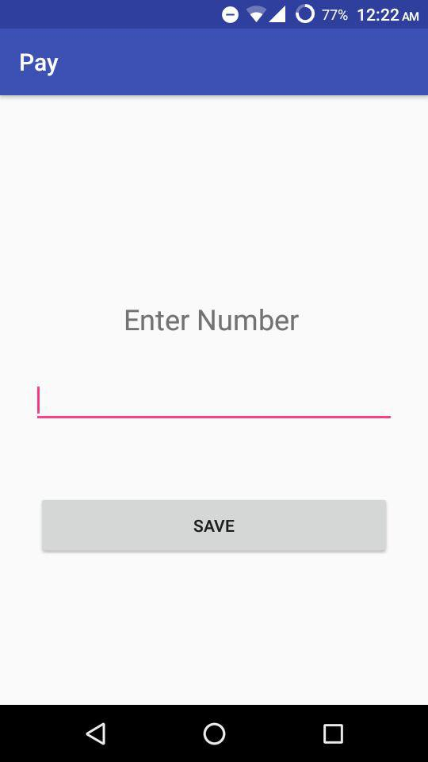
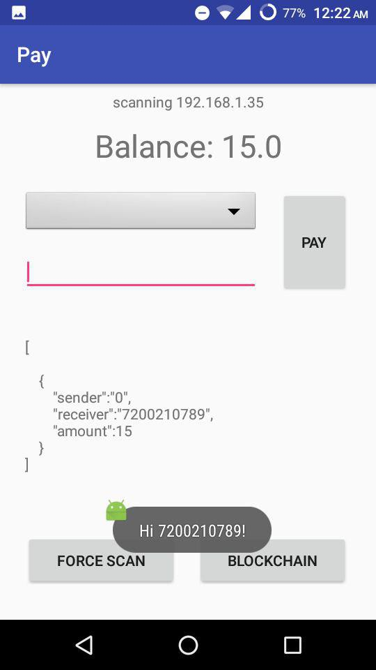
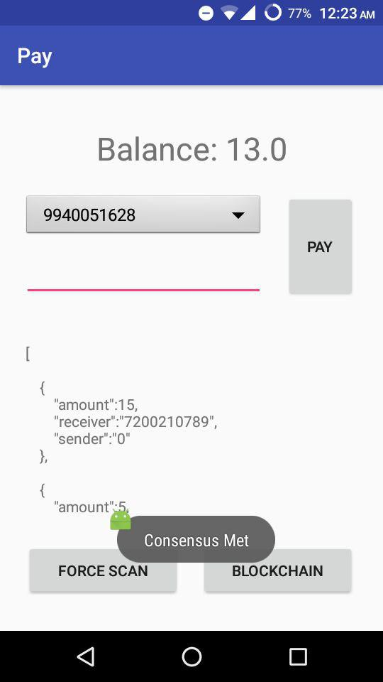
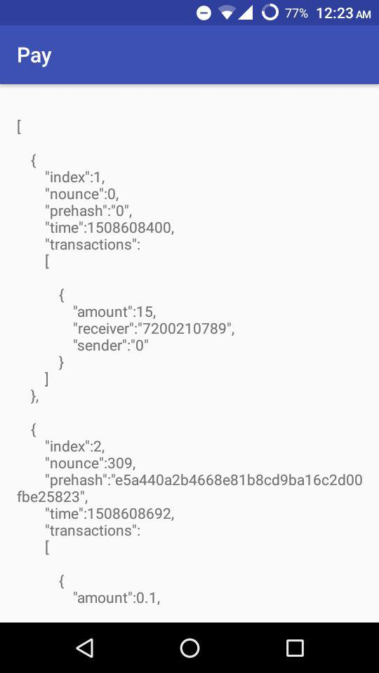

# Pay - Blockchain Demo App
A simple app to demonstrate blockchain. The app scans the private network for the longest valid chain.

Each transaction is mined as a block.

Consensus: Before making a transaction get the longest valid chain.

Hash: SHA1

Difficulty: 2

Genesis Block: 15 to #7200210789

Mining Value: 0.1

Proof Of Work: Previous Block + Nonce

Screenshots:

###### App was developed for learning purpose, may have lot of bugs.
